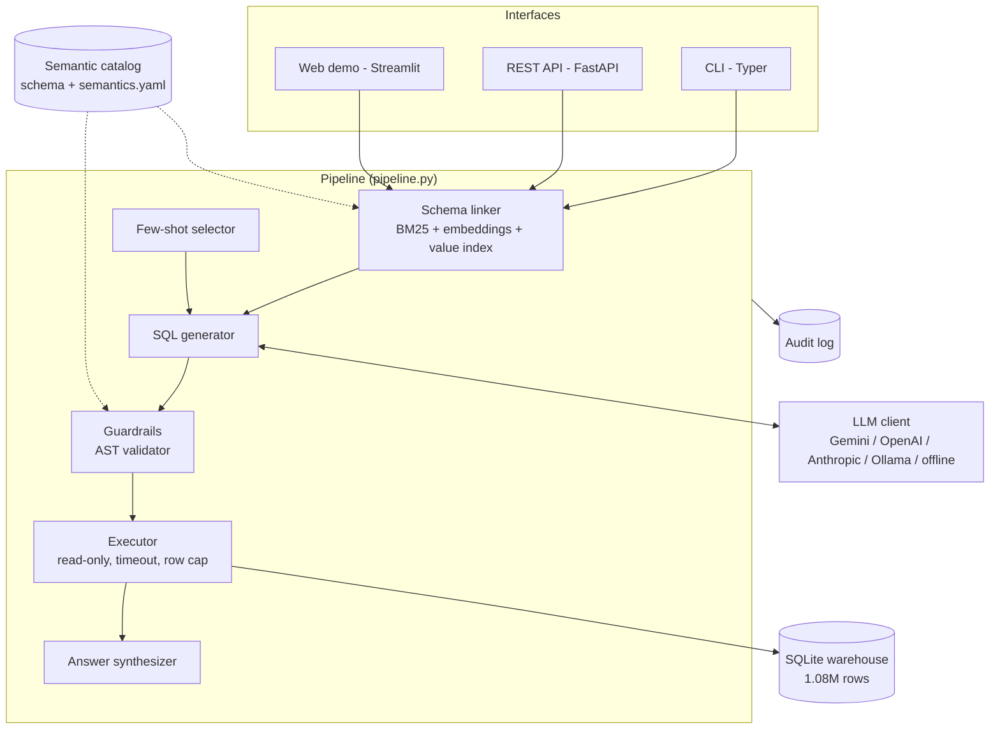
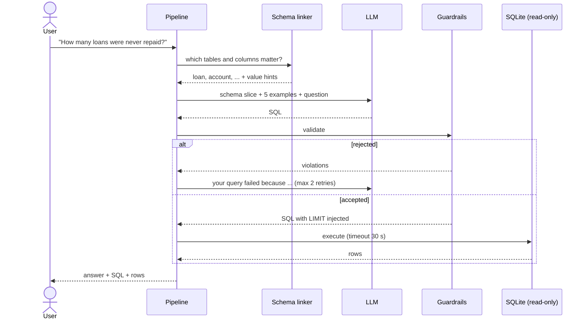
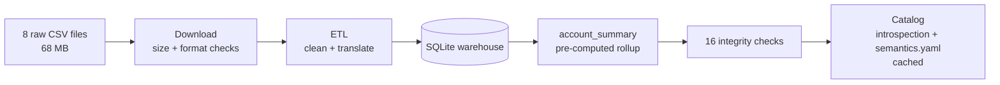
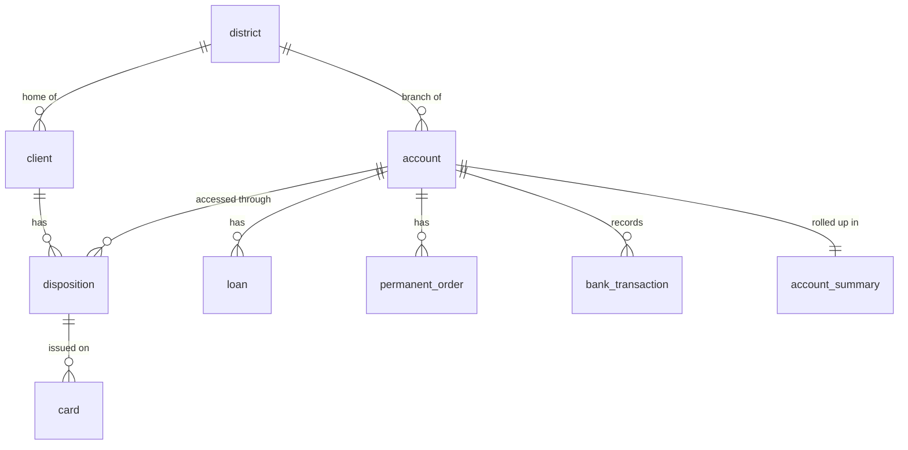

# 🏦 Ask the Bank: AI Text-to-SQL over a Real Banking Database

[](https://github.com/Harshit-Poddar90/nl2sql-bank/actions/workflows/ci.yml)


Ask questions about a real bank's data in plain English. The system writes the SQL, checks that
it is safe, runs it on a database of **over one million transactions**, and answers in plain
English. It shows the query and the rows too, so every answer can be verified.

```console
$ nl2sql ask "How many people have more than 50,000 in their bank account?" --offline

╭─ Answer ─────────────────────────────────╮
│ 1,627 people.                            │
╰──────────────────────────────────────────╯

SELECT
  COUNT(*) AS count
FROM account_summary
WHERE
  current_balance > 50000
LIMIT 1000
```

## Contents

- [Overview](#overview)
- [System architecture](#system-architecture)
- [How a question is answered](#how-a-question-is-answered)
- [Data pipeline and schema](#data-pipeline-and-schema)
- [Safety model](#safety-model)
- [Examples](#examples)
- [Evaluation](#evaluation)
- [Getting started](#getting-started)
- [Configuration](#configuration)
- [Project structure](#project-structure)
- [Design decisions](#design-decisions)
- [Limitations](#limitations)
- [Dataset and license](#dataset)

---

## Overview

**The problem.** Business questions ("which region has the most unpaid loans?") are answered by
SQL, and most people who ask them can't write it. Language models can, but they invent column
names, misread what the data means, and will run anything they produce, including a `DELETE`.

**The approach.** The language model is treated as one untrusted component inside a system that
controls what it sees, checks what it writes, and measures how often it is right.

| | |
|---|---|
| **Data** | 1,084,180 rows from an anonymised Czech bank (1993–1998): 9 tables + 3 views |
| **Interfaces** | Command line, REST API (FastAPI), web demo (Streamlit) |
| **Models** | Gemini (default), OpenAI, Anthropic, local Ollama, or a built-in offline generator |
| **Safety** | Syntax-tree validation, read-only database, timeout, row limit |
| **Quality** | 70-question benchmark scored by comparing actual query results |
| **Ops** | Docker, GitHub Actions CI, structured logs, audit log of every question |

---

## System architecture



| Component | File | Responsibility |
|---|---|---|
| Pipeline | `pipeline.py` | Runs the steps below, owns the repair loop, records timings and token usage |
| Semantic catalog | `catalog/` | Tables, columns, keys, real sample values, plus a hand-written business glossary |
| Schema linker | `retrieval/` | Selects the relevant tables and columns for a question |
| Few-shot selector | `generation/few_shot.py` | Picks 5 similar solved examples from a bank of 26 |
| SQL generator | `generation/` | Builds the prompt, calls the model, extracts SQL from the reply |
| LLM clients | `llm/` | One REST client per provider with shared retries and error handling |
| Guardrails | `guardrails/validator.py` | Rejects unsafe or invalid SQL and injects a row limit |
| Executor | `execution/executor.py` | Runs SQL read-only with a timeout and row cap |
| Answer synthesizer | `answer/synthesizer.py` | Turns rows into a sentence |
| Audit log | `observability/query_log.py` | Stores every question, its SQL, outcome, timings and cost |

---

## How a question is answered



1. **Schema linking.** Three rankers score every table and column: BM25 on names, descriptions
   and synonyms; embeddings (`bge-small-en-v1.5` via ONNX) for meaning; and a value index that
   spots data values in the question ("Benesov" is a value in `district.district_name`). The
   rankings are merged with Reciprocal Rank Fusion. The top 6 tables are kept, plus any table
   they reference by foreign key, with their most relevant columns.
2. **Prompting.** The model receives that schema slice with real enum values and business rules,
   hints for any values found, and 5 solved examples picked by similarity with a diversity penalty.
   One example always demonstrates refusal (`-- CANNOT_ANSWER: <reason>`), so the model knows it
   may decline instead of inventing a column.
3. **Validation.** The reply is parsed into a syntax tree with `sqlglot` and checked (see
   [Safety model](#safety-model)). A `LIMIT` is written into the tree.
4. **Execution.** SQLite is opened with `mode=ro`. A progress handler aborts queries that exceed
   the time budget; it fires every 10,000 VM instructions, since SQLite has no statement timeout.
   One extra row is fetched to detect truncation.
5. **Repair.** If validation or execution fails, the model gets its query and the exact error
   ("Unknown column 'current_balence' (did you mean 'current_balance'?)") and tries again, at
   most twice.
6. **Answer.** Unambiguous shapes use templates: a single number, one row, or a label plus value
   ranking. Other shapes are phrased by the model. The whole request is written to the audit log.

---

## Data pipeline and schema



The raw data is hostile to a language model, so the ETL reshapes it:

| Raw data | After ETL |
|---|---|
| Dates as `930101` | `1993-01-01` |
| Czech codes: `POPLATEK MESICNE`, `VYBER KARTOU` | English labels, with the original code kept alongside |
| District columns named `A1`…`A16` | `average_salary`, `unemployment_rate_1996`, … |
| Gender hidden in the birth number (women +50 on the month) | `birth_date` and `gender` columns |
| Tables named `order` and `trans` (SQL keywords) | `permanent_order`, `bank_transaction` |

The build verifies itself with 16 checks: row counts match the dataset's published figures,
foreign keys hold, and every account has exactly one owner. Loan outcomes come out at 606 good and
76 bad loans, as the dataset documents.



| Table | Rows | Contents |
|---|---:|---|
| `bank_transaction` | 1,056,320 | every movement of money, with the balance after it |
| `permanent_order` | 6,471 | standing orders |
| `client` | 5,369 | clients, with gender and birth date decoded |
| `disposition` | 5,369 | who can use which account: `OWNER` or `DISPONENT` |
| `account` | 4,500 | accounts |
| `account_summary` | 4,500 | pre-computed balance and activity per account |
| `card` | 892 | credit cards: `junior`, `classic`, `gold` |
| `loan` | 682 | loans and their repayment status |
| `district` | 77 | regional demographics and economics |

Three views (`v_account_overview`, `v_client_overview`, `v_loan_overview`) pre-join common paths.

---

## Safety model

Two independent layers must both fail before anything is damaged.

| Layer | Check | Stops |
|---|---|---|
| Validator | Must parse | malformed SQL |
| Validator | Exactly one statement | stacked injection: `SELECT 1; DROP TABLE loan` |
| Validator | Read-only, checked on every node | `INSERT`, `DELETE`, `DROP`, `PRAGMA`, `ATTACH`, even a `DELETE` inside a CTE |
| Validator | Forbidden functions | `load_extension`, `readfile`, `writefile` |
| Validator | Table and column allowlist | hallucinated names, `FROM sqlite_master AS sqlite_master` |
| Validator | Join limits | cartesian products involving the million-row table; more than 8 tables |
| Validator | `LIMIT` injected into the tree | unbounded results (capped at 1,000 rows) |
| Database | Opened read-only (`mode=ro`) | any write that got past the validator |
| Database | Timeout via progress handler | long-running queries (30 s default) |

The validator reads the syntax tree, never the raw text. A text filter looking for `DROP` blocks
harmless queries that only mention the word and misses anything it didn't list.

---

## Examples

All output below is real, produced with the offline generator (`--offline`). SQL is condensed for
readability.

| Question | Generated SQL (abridged) | Answer |
|---|---|---|
| What is the average account balance? | `SELECT ROUND(AVG(current_balance), 2) FROM account_summary` | 43,808.94 CZK |
| How many loans were never repaid? | `SELECT COUNT(*) FROM loan WHERE is_defaulted = 1` | 76 loans |
| How many gold cards were issued in 1996? | `... WHERE card_type = 'gold' AND STRFTIME('%Y', issued_date) = '1996'` | 5 cards |
| How many clients actually own an account? | `SELECT COUNT(*) FROM account_summary` | 4,500 clients |

**Grouping:** "Break down the loans by status, showing how many of each"

```sql
SELECT status, COUNT(*) AS count
FROM loan
GROUP BY status
ORDER BY 2 DESC
LIMIT 1000
```

| status | count |
|---|---:|
| running, payments up to date | 403 |
| finished, paid in full | 203 |
| running, client in debt | 45 |
| finished, not paid (defaulted) | 31 |

**REST API** (start it with `nl2sql serve`; responses abridged):

```bash
curl -s localhost:8000/ask -H "Content-Type: application/json" \
     -d '{"question": "How many loans were never repaid?"}'
```

```json
{
  "answer": "76 loans.",
  "sql": "SELECT\n  COUNT(*) AS count\nFROM loan\nWHERE\n  is_defaulted = 1\nLIMIT 1000",
  "success": true,
  "refused": false,
  "columns": ["count"],
  "rows": [[76]],
  "repair_attempts": 0,
  "guardrail_blocked": false,
  "timings_ms": {"retrieval": 5.5, "generation": 14.9, "validation": 10.8, "execution": 2.0, "total": 28.6}
}
```

**Blocked query:**

```bash
curl -s localhost:8000/validate -H "Content-Type: application/json" -d '{"sql": "DELETE FROM loan"}'
```

```json
{
  "accepted": false,
  "violations": [
    "Only SELECT queries are allowed; this is a DELETE statement.",
    "DELETE is not permitted. This system has read-only access to the database."
  ]
}
```

---

## Evaluation

**Method.** 70 hand-written questions (20 easy, 25 medium, 20 hard, 5 unanswerable), each with a
reference SQL query. A prediction counts as correct when its result set matches the reference.
Column order and number formatting (`5369` vs `5369.0`) are ignored, and so is row order unless the
question asks for a ranked top-N. Unanswerable questions count as correct only when the system
refuses.

**Baseline results** (offline rule-based generator, no AI):

| | Easy | Medium | Hard | Unanswerable | **Overall** |
|---|---:|---:|---:|---:|---:|
| Accuracy | 95.0% | 20.0% | 0.0% | 0.0% | **36.9%** |

It produces valid SQL 100% of the time and fails on meaning: 41 wrong results, plus 5 missed
refusals. Pattern matching handles simple counts and collapses on joins, ratios and subqueries.
That is the gap a language model has to close.

```bash
make eval             # benchmark the configured model
make eval-ablations   # re-run without retrieval, few-shot examples, or self-repair
```

Each run writes a Markdown and JSON report with accuracy per difficulty and category, failure
modes, latency (p50/p95), tokens and estimated cost. See
[`evaluation/reports/latest.md`](evaluation/reports/latest.md).

---

## Getting started

**Requirements:** Python 3.10+, about 1 GB of disk space (data and dependencies), and optionally an
API key.

```bash
git clone https://github.com/Harshit-Poddar90/nl2sql-bank.git
cd nl2sql-bank
make setup                      # virtualenv, dependencies, downloads data, builds the database
source .venv/bin/activate       # Windows: .venv\Scripts\activate
nl2sql ask "how many loans defaulted?" --offline
```

On Windows without `make`, replace `make setup` with:

```powershell
python -m venv .venv
.venv\Scripts\pip install -e ".[embeddings,ui,dev]"
.venv\Scripts\nl2sql data build
```

**Use a real AI model:** copy `.env.example` to `.env` and add a key.
[Gemini keys are free](https://aistudio.google.com/apikey).

| Command | What it does |
|---|---|
| `nl2sql ask "..."` | Answer a question (`--offline`, `--json`, `--trace`, `--explain`) |
| `nl2sql validate "SQL"` | Run SQL through the safety checks without executing it |
| `nl2sql schema --for "..."` | Show which tables the retriever picks for a question |
| `nl2sql eval` | Run the benchmark |
| `nl2sql serve` | REST API on port 8000, interactive docs at `/docs` |
| `nl2sql ui` | Web demo on port 8501 |
| `nl2sql history` | Recent questions from the audit log |
| `nl2sql data build` / `verify` | Rebuild or re-check the database |
| `docker compose up` | Run the API in Docker (`--profile ui` adds the web demo) |

---

## Configuration

Set in `.env` or as environment variables. All settings live in
[`src/nl2sql/config.py`](src/nl2sql/config.py).

| Variable | Default | Purpose |
|---|---|---|
| `NL2SQL_LLM_PROVIDER` | `gemini` | `gemini`, `openai`, `anthropic`, `ollama` or `stub` (offline) |
| `NL2SQL_GEMINI_API_KEY` | – | Key for the selected provider (also `_OPENAI_`, `_ANTHROPIC_`) |
| `NL2SQL_LLM_MODEL` | provider default | e.g. `gemini-2.5-flash`, `gpt-4o-mini` |
| `NL2SQL_MAX_RESULT_ROWS` | `1000` | Row limit injected into every query |
| `NL2SQL_QUERY_TIMEOUT_SECONDS` | `30` | Per-query time budget |
| `NL2SQL_MAX_REPAIR_ATTEMPTS` | `2` | Self-repair retries (`0` disables) |
| `NL2SQL_RETRIEVAL_ENABLED` | `true` | `false` sends the whole schema to the model |
| `NL2SQL_FEW_SHOT_COUNT` | `5` | Solved examples per prompt |
| `NL2SQL_EMBEDDINGS_ENABLED` | `true` | `false` uses a NumPy fallback instead of ONNX |
| `NL2SQL_DB_PATH` | `data/db/bank.sqlite` | Location of the database |

---

## Project structure

```
src/nl2sql/
├── pipeline.py            orchestrates the request lifecycle
├── config.py              typed settings
├── catalog/               schema introspection + semantics.yaml (business glossary)
├── retrieval/             BM25, embeddings, value index, rank fusion
├── generation/            prompts, few-shot selection, SQL extraction
├── llm/                   provider clients + offline generator
├── guardrails/            SQL safety validator
├── execution/             read-only query runner
├── answer/                result -> sentence
├── observability/         audit log
├── data/                  download, ETL, integrity checks, schema.sql
├── evaluation/            benchmark questions, scoring, reports
├── api/                   FastAPI service
└── cli.py                 command line
app/streamlit_app.py       web demo
docs/ARCHITECTURE.md       design notes and trade-offs in depth
```

---

## Design decisions

- **The model is untrusted.** Its output is parsed, checked against the real schema and run
  read-only. Safety does not depend on the prompt being obeyed.
- **A pre-computed `account_summary` table.** The most common question, "how many accounts have
  more than X?", needs a window function over 1,056,320 rows: **994 ms**. From the summary table it
  takes **under 1 ms**. The cost is staleness, which is zero for a historical dataset.
- **Retrieval even though the schema is small.** Twelve tables would fit in a prompt, but
  retrieval is what scales to hundreds. `make eval-ablations` measures what it contributes here.
- **Plain REST instead of vendor SDKs.** Each provider is one JSON POST, so retries, backoff and
  error handling are identical across providers, which keeps model comparisons fair.
- **Refusal as a defined output.** Without it, a model asked for client names invents
  `client.name`. The benchmark measures refusal separately.
- **A real offline baseline.** The rule-based generator lets anyone run the whole system without a
  key, and gives the benchmark an honest point of comparison.

More in [`docs/ARCHITECTURE.md`](docs/ARCHITECTURE.md).

---

## Limitations

- **AI accuracy is not yet published.** Only the offline baseline has been benchmarked; run
  `make eval` with a key to measure a model.
- **Small, custom benchmark.** 70 questions on a single database, written by the author. The
  scores are not comparable to Spider or BIRD.
- **SQLite and static data only.** `account_summary` is rebuilt in full rather than updated
  incrementally, so live data would need a different refresh strategy.
- **No authentication on the REST API.** There are also no rate limits. Run it behind a gateway;
  don't expose it publicly as-is.
- **One question at a time.** There is no conversation memory, so follow-up questions such as
  "and in 1997?" are not understood.
- **Column checks are schema-wide.** A real column used on the wrong table passes validation; the
  database then rejects it and the repair loop handles it.
- **In-memory retrieval.** It suits 12 tables but not thousands, and retrieval quality is only
  measured end to end.
- **Heuristic answer templates.** For example, the ranking sentence assumes the first row is the
  top result.
- **Estimated costs.** They come from a static price table, not billing data.

---

## Dataset

[PKDD'99 Financial (Berka) dataset](https://relational-data.org/dataset/Financial): anonymised
records of a real Czech bank from 1993–1998, released for the
[PKDD'99 Discovery Challenge](https://web.archive.org/web/20180506061559/http://lisp.vse.cz/pkdd99/Challenge/chall.htm)
for research and education. `make setup` downloads the CSV files (68 MB) automatically from
[this mirror](https://github.com/compfiggg-hu/berka-bank-cohort-analysis).

## License

MIT. Built by [Harshit Poddar](https://github.com/Harshit-Poddar90).
